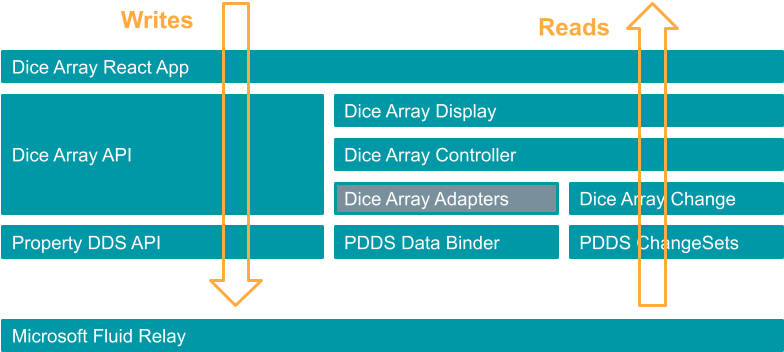

# Array Slice Property Data Binder

This exercise investigates using the PropertyDDS DataBinder directly for dynamic path registration.
For the problem at hand the code complexity is comparable to the [Data Binding](../array-property-binding/) solution.
Deserves noted that while algorithms are similar, listener registration paths are absolute (vs. the relative paths in the Data Binding exercise). 

The full set of the implications is still to be determined but few theoretical aspects emerge:
- The full path registration strategy (ie the `DataBinder` approach) can lead to a proliferation of paths, which depending on the property tree complexity and binding requirements can impact the solution scalability. 
- The implementation of a solution exclusively based on the `DataBinder` can easily grow also in complexity, for instance tracking whether an `insert` happens at a given location in the tree may easily turn into tracking for the entire parent path to the root for `insert`s & `modification`s
- The competing solution based on the `DataBinding` approach (and inherently relative navigation paths), depending on the nature of the data model (eg having multiple occurrences of the  same data type in the property tree, large size), could be more efficient and implicitly scale better.


# Data Flow



# Demo


# Getting Started

Needed dependencies
```
$ node --version
v16.13.1

$ npm --version
8.1.2
```

Using NVM for node version management
```sh
nvm use v16.13.1
```
## Build

```sh
cd FluidPatterns
npm run clean
npm install --legacy-peer-deps
npm run build
```


## Run

Terminal 1

```sh
npx tinylicious
```

Terminal 2

```sh
cd FluidPatterns/apps/array-slice-property-binder
npm install -g serve
serve -s build
```
or

```sh
cd FluidPatterns/apps/array-slice-property-binder
npm start
```

## Disclaimer

This project has adopted the [Microsoft Open Source Code of Conduct](https://opensource.microsoft.com/codeofconduct/).
For more information see the [Code of Conduct FAQ](https://opensource.microsoft.com/codeofconduct/faq/) or contact
[opencode@microsoft.com](mailto:opencode@microsoft.com) with any additional questions or comments.

This project may contain Microsoft trademarks or logos for Microsoft projects, products, or services. Use of these
trademarks or logos must follow Microsoft’s [Trademark & Brand Guidelines](https://www.microsoft.com/trademarks). Use of
Microsoft trademarks or logos in modified versions of this project must not cause confusion or imply Microsoft
sponsorship.
