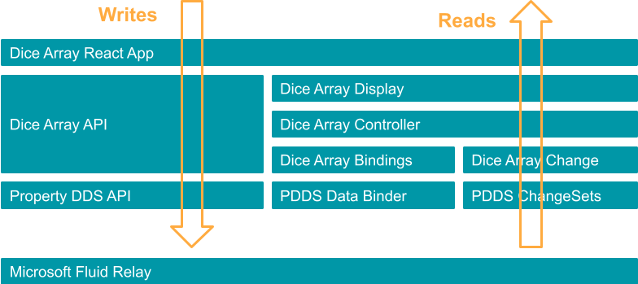
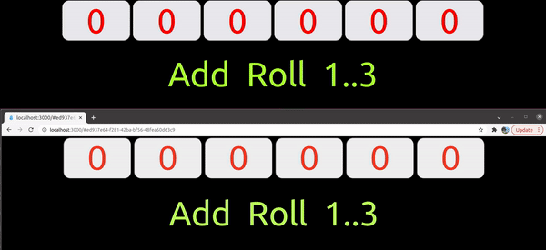

# Array Slice Property Data Binding 

This exercise investigates the capabilities of the PropertyDDS `DataBinding` API to extract dynamic data fragments. 

The emerging conclusion is that while the pattern remains a possibility, the usage seems to stretch the original design intentions in case of dynamic binding registration.

The `type` association with the `DataBinding` seems however to play very well when the data definition & navigation is static in nature. The `DataBinding` promotes good modularity and consistency in behavior (ie data is extracted consistently from data of same category/type)


# Data Flow



# Demo



# Getting Started

Needed dependencies
```
$ node --version
v16.13.1

$ npm --version
8.1.2
```

Using NVM for node version management
```sh
nvm use v16.13.1
```
## Build

```sh
cd FluidPatterns
npm run clean
npm install --legacy-peer-deps
npm run build
```


## Run

Terminal 1

```sh
npx tinylicious
```

Terminal 2

```sh
cd FluidPatterns/apps/array-slice-property-binding
npm install -g serve
serve -s build
```
or

```sh
cd FluidPatterns/apps/array-slice-property-binding
npm start
```

## Disclaimer

This project has adopted the [Microsoft Open Source Code of Conduct](https://opensource.microsoft.com/codeofconduct/).
For more information see the [Code of Conduct FAQ](https://opensource.microsoft.com/codeofconduct/faq/) or contact
[opencode@microsoft.com](mailto:opencode@microsoft.com) with any additional questions or comments.

This project may contain Microsoft trademarks or logos for Microsoft projects, products, or services. Use of these
trademarks or logos must follow Microsoft’s [Trademark & Brand Guidelines](https://www.microsoft.com/trademarks). Use of
Microsoft trademarks or logos in modified versions of this project must not cause confusion or imply Microsoft
sponsorship.
