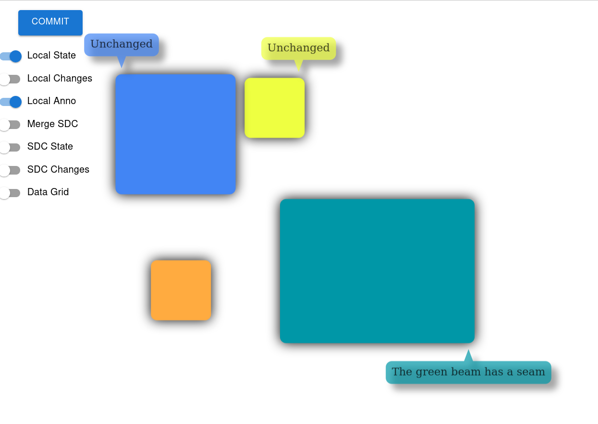

# Multi-Session Search Enabled Assembly Authoring

Investigate the ability to externalize PropertyDDS data in domain specific materialized views. 

It is our experience that most of the data management use cases are typically I/O bound (however differently on the write and query side) and there is always a denormalization strategy which addresses the performance problems. In a CQRS like pattern the PropertyDDS / SharedPropertyTree (ST) would be the write model, but query cases, for efficiency reasons, would have to be served inevitably by MaterializedViews (MV) derived / projected from the data stored in collections of STs.

Now such MVs would reside outside Fluid and have very different SLAs. There are 3 design aspects we believe to be ubiquitous:

- Fluid Relay (FR) high availability (HA) should be sufficient and the only prerequisite to ensure convergence to (eventual) consistency across collections of STs and including multiple MVs. This needs to happen independent of network outages and even software bugs to be corrected, meaning extremely variable MV availability
- Efficient (reduced I/O, ideally not diff based) MV incremental updates. One possible pattern is that MVs would own/track internally the version of a synchronized ST state and be able to request the delta/change between its known/old ST state and current ST state. Even more, some data management use-cases need to capture multiple revisions of the data and it is very good possible that a particular MV will have to track ALL changes (rather than the squashed change).
- Highly scalable and resilient MV indexing (million of STs or partial ST fragments) by design. A (persistent) notification mechanism, accounting for the fact that MVs may be unavailable at the notification time. Only when notified the MVs will request the deltas from a particular ST

## Getting Started

Needed dependencies
```
$ node --version
v16.13.1

$ npm --version
8.1.2
```

Using NVM for node version management
```sh
nvm use v16.13.1
```
## Build

```sh
cd FluidPatterns
npm run clean
npm install --legacy-peer-deps
npm run build
```

## Configure

Add elastic, elasticvue entries to `/etc/hosts`

```sh
127.0.0.1       localhost
127.0.1.1       elastic elasticvue
```

## Run

> Note: Starting order is relevant.

1. Start Tinylicious

```sh
npx tinylicious
```

2. Start _Elastic Search Database_ 

```sh
cd FluidPatterns/apps/assembly-search-agent
docker-compose up
```

3. Start _Plexus Nameservice_

```sh
cd FluidPatterns/apps/plexus-nameservice-agent
npm start
```

4. Start _Assembly Indexing/Search Service_

```sh
cd FluidPatterns/apps/assembly-search-agent
npm start
```

5. Start _Assembly Authoring Application_

```sh
cd FluidPatterns/apps/assembly-authoring-tracked
npm start
```

6. Start _Assembly Search Application_

```sh
cd FluidPatterns/apps/assembly-search
npm start
```

## Requirement Notes

- Once initialized, any MV be updated incrementally (only). Refreshing full tree data is suboptimal and therefore not desired.
- The solution has to provide a way to preserve all changes associated with multiple ST containers for a long and deterministic time window.
- FR high-availability should be sufficient to guarantee the overall availability and zero data loss, including multiple materialized views
- Guaranteed eventual consistency. It is expected that MVs can go offline for longer (eg. deserialization bugs or upgrade procedures) or shorter (eg. kubernetes restarts) time frames. When returning online, they should catch-up efficiently.
- The granularity of the changes stored with the change log should be configurable, for instance to match custom data revising policies
- The emerging system should be fully auditable, for instance able to observe runtime operations, queries or results from production systems


## Design Notes

- MVs are synchronized via an ST based change log
- Change log offsets associated with individual MVs (ie last read offset) is tracked using the ST infrastructure - [the Tracker](../../libs/tracker-util)
- Queries and results are also regarded as messages transmitted over an ST based query and result log - [Plexus](../../libs/plexus-util/)

### Legend

| What | Symbol |
| :---: | :---: |
| ST / Shared Tree / PropertyDDS |  |

### Authoring


### Search


### Components

- Apps
  - [Plexus Nameservice Agent](../plexus-nameservice-agent/)
  - [Assembly Indexing/Search Agent](../assembly-search-agent/)
  - [Assembly Authoring](../assembly-authoring-tracked/)
  - [Assembly Search](../assembly-search/)

- Libs
  - [Assembly Util](../../libs/assembly-util/)
  - [Plexus Util](../../libs/plexus-util/)
  - [Fluid Util 2](../../libs/fluid-util2/)


>Disclaimer: This is POC level software


## Authoring Workflow


Edit above [diagram](https://sequencediagram.org/index.html#initialData=C4S2BsFMAIEEFdgAsD2AnEA7A5tA6ugNYBm4KA7gFCUAOAhmqAMYj2bDZorw3QCy8cKBpRoAYXAhI7aAGVIAZwUgUmBZTpNg6OJKaRaDZqzoyEydFlzylKzIcYgWbYHCWQAtgCNwATwAi-rKU0gAm1PSOzqauAApQAB7wCtAAcnQeipBoAG5OBpHGLtAAKmiahNmBwYVOJjLxkEkpAJKYoU1WcNjSwA5FMdCNzdWUoXTAdF50CjAAouAzzNTDydBtHQldsD3sALQAfABUqwrVAFyUmCjAMCg52UOJyRcA9CjExLPACgA6mK8AI7wbK+AAyKGw-yBILQvgASopBMAIdhKKd1u1Ojhur1DkcyhUqkFLujnq0sVscTtegAeQ4Y9KZWa5fLnNCQbAgBS3NCvHrAU5iVSTLDZFrhMlNNYbbG4GnsekHRkZLKs-Tsznc3n8yDAQlMSpoYXsOhitAS6jmVAYHE2ZSqekq5nZPIagUGo0m0WYcXha2WO2KB2YfGwdzePwXSgB23WYN2Q7h2aRgIkjlcnlVCZ0ABCWFCVhjekgScQNq69rs5zo5fQMbrcbkCdUSYjPjTsnOHhQheIvhj7ajQTLFibVdU52uoH7-hzYiQph66k43F4AGIAEzETeQADsXmgZBQG-ISDABmTng71TbKZvJIU8A8HgYIAAXpBhRzB-fh7I72vf9zhoNB4F9AAJbV0AHK9U1vA5PWJLsFGBGYkAXJdFGgAAyaAaHgHxuSQEJ2ilZpMU2bZdmAJ1yQuAUxHgNAOXYAB5T5vkoVceGgLcd33Q9j1Pc9bnImVKWovFEPKQ1kJAlBwHAAAKD4vj1ABKcSKSo6kaIZclKLlXF2BAhhZkwnBIHkPptKMql5X0g4FiWJxziwFlgFeHs+wHHjeBAYhoCfJh9CUOzZQckzgAM6UzkfPUmJY3oOPUvowlI0JoEoIA)

## Search Workflow


Edit above [diagram](https://sequencediagram.org/index.html#initialData=C4S2BsFMAIGVIIYCcDGALaB1A9kg1gGbjYDuAUGQisLtAILggqRkAOyoKI7AdsHIlQYAwo0h8K7JJ24I+0AApQAHgFcAztAByCALaR1kJADcmLKTN78lkNZvjJ09AObjgbDk1nybdgCJ+sGQAJgjACABGCIbQAKLg0ZwUvhoCjhh0rnwAtAB8AFQp6gGwAFwUPNjAMNjGRooqGiWlAPTYBASGwOoAOjwtAI6qRgCeADLYzn2Dw0gjAEoGquDAE87JjfaCTpluADx5Rdp6BkamzKVIkM4g6tVILa7ARcLYfAggPEYAksEbtqkHEIXPtDptjvpDCYzJdrrd7o9IMAACpIKh4Iyvd6fH5-MhHIE7LLAMEA4qBWE3O5GACKsxGACFPsEjBRCSIxHwDkcdJCzjCni83uEcUhfmR2dBRCA3KT-BSrlT7nTRot1MtgEyeCykGQGGY8pLpW5SoZ0hLthyZTlckVmoZtSq5v95bA5YDLSC+KVKqACCMnSN8eDJbsbQTPWHgKUpIZA8GyWlgVGDrl4okmDGjARcLp4xH0l6SbbNvbxMFA2qNeoE67DZ7jd7fSB-ZWlisa0bOcX9RcruqO0A)


# Visual Paradigm - Session 1

Collaborative authoring session outcome is continuously persisted. 


# Visual Paradigm - Session n



# Search Language

Search is possible when sessions are active (interactive search) and also long after their completion (analytics, forensics, etc. - assembly / component versioning is for sure the next important ingredient but out of scope for the current investigation).  For simplicity and expressiveness our demo offers however a mini search language allowing:

__Range filters__ for  `x, y, width, height`, eg.:

```
width:100-200
```

__Exact matches__ for `fill, id`, eg.:

```
id:rect1
```

__Full text__ search for `annotation` field, eg.:

```
green beam
```

__Combined syntax__, eg.:

```
width:100-110 height:400-500 beam
```

# Visual Paradigm - Search


# Visual Paradigm - Search Result Detail 1

From the search results list the user can rehydrate the full session context (assembly) of the selected component. The resulted component can be visually highlighted (notice the dark frame below) in its assembly context.


# Visual Paradigm - Search Result Detail 2
Just another detail page corresponding to a different result (third in the list above)


## Disclaimer

This project has adopted the [Microsoft Open Source Code of Conduct](https://opensource.microsoft.com/codeofconduct/).
For more information see the [Code of Conduct FAQ](https://opensource.microsoft.com/codeofconduct/faq/) or contact
[opencode@microsoft.com](mailto:opencode@microsoft.com) with any additional questions or comments.

This project may contain Microsoft trademarks or logos for Microsoft projects, products, or services. Use of these
trademarks or logos must follow Microsoft’s [Trademark & Brand Guidelines](https://www.microsoft.com/trademarks). Use of
Microsoft trademarks or logos in modified versions of this project must not cause confusion or imply Microsoft
sponsorship.

