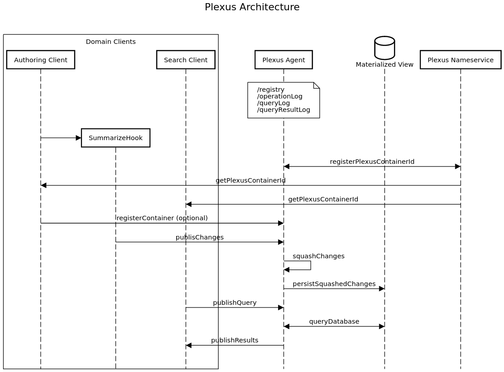

# Plexus Experiment 

Investigates the ability of FluidFramework / PropertyDDS infrastructure to externalize and consolidate the information stored in multiple containers serving a single domain application. The goal of the exercise is to evaluate the possibility of adding specialized query support via materialized views. 


# Getting Started

Needed dependencies
```
$ node --version
v16.13.1

$ npm --version
8.1.2
```

Using NVM for node version management
```sh
nvm use v16.13.1
```
## Build

```sh
cd FluidPatterns
npm run clean
npm install --legacy-peer-deps
npm run build
```

# Run

> Note: Starting order is relevant.

1. Start _Plexus Fulltext Indexing Service_ 

```sh
cd FluidPatterns
docker-compose up
```

2. Start _Plexus Nameservice_

```sh
cd FluidPatterns/apps/plexus-nameservice-agent
npm start
```

3. Start _Plexus Service_

```sh
cd FluidPatterns/apps/plexus-service-agent
npm start
```

4. Start _Comment Authoring Application_

```sh
cd FluidPatterns/apps/comment-authoring
npm start
```

5. Start _Comment Search Application_

```sh
cd FluidPatterns/apps/comment-search
npm start
```

## Packages

- Apps
  - [Plexus Nameservice Agent](../../apps/plexus-nameservice-agent/)
  - [Plexus Service Agent](../../apps/plexus-service-agent/)
  - [Comment Authoring](../../apps/comment-authoring/)
  - [Comment Search](../../apps/comment-search/)

- Libs
  - [Comment Util](../../libs/comment-util/)
  - [Plexus Util](../../libs/plexus-util/)


## Workflow



Edit the sequence [diagram](https://sequencediagram.org/index.html#initialData=C4S2BsFMAIAUoB4FcDO0CCAnAxgCzJNsEppAFBkAOAhpqNiDQHbADmmA9kpdACIcBbaiCbQAwuBCQWKKrXqNqLDEmC4OmEa3GTpwOXRANmwaAGUkAoZoBekABIcOAawMKT5yLTw6pLMtIAJtAUNIbGSqbwkMho6Kx6ZIHUwNQARtQoMACyKZCa1JJ2wQBqUgDubkaKytGx0ABy1AKQWZgAbkbkZEwcwDAc7flwiKgYCSwAXAD0pKwgKMCYAJ4AOkzTHJT5KSAcTAAyHKzr0wCOSPnLRycbF1cASq1I4MA3FOiq6ppM2hJ+wAAtAA+ABUFistBAdkcLkmFDqY3iegAPCDEWgmi02p1sJBJnMFv1MBixPtUiJ8gBJQIfL4aLS+VGAjGNZqtfK4-EJYCk8nCJjU2lkMxeHC4JksNGsrEcjpdSY8vksAVCulqBm-SVA4Gs5FTQmLfJklWUzDQAAUW1A+0KAEoKBDrNCHE5nOjRnEJsBJpQkGlJCgxLglAlZGQ9d6PTEkd7JigLplcMHQ60EZ7xnoQbliSBCi7ShVffkUESzImULhIIEU780yKxT5-lndRn9T6-QGFrgAIqXFbpmNe5nAnP5PNFavQMqQcqTe4rXgpdKZbqRlui7wS5tTTuB3BPFAvYAoIA)

## Disclaimer

This project has adopted the [Microsoft Open Source Code of Conduct](https://opensource.microsoft.com/codeofconduct/).
For more information see the [Code of Conduct FAQ](https://opensource.microsoft.com/codeofconduct/faq/) or contact
[opencode@microsoft.com](mailto:opencode@microsoft.com) with any additional questions or comments.

This project may contain Microsoft trademarks or logos for Microsoft projects, products, or services. Use of these
trademarks or logos must follow Microsoft’s [Trademark & Brand Guidelines](https://www.microsoft.com/trademarks). Use of
Microsoft trademarks or logos in modified versions of this project must not cause confusion or imply Microsoft
sponsorship.
