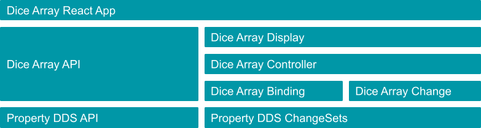
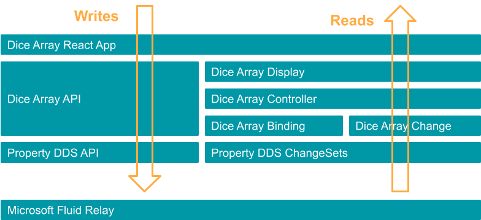

# More Complex Property Data Binding 

Investigates the Property DDS binding API with a slightly more complex scenario. See [simple binding app](../simple-property-binding) for a simpler scenario.


# Getting Started

Needed dependencies
```
$ node --version
v16.13.1

$ npm --version
8.1.2
```

Using NVM for node version management
```sh
nvm use v16.13.1
```
## Build

```sh
cd FluidPatterns
npm run clean
npm install --legacy-peer-deps
npm run build
```


## Run

Terminal 1

```sh
npx tinylicious
```

Terminal 2

```sh
cd FluidPatterns/apps/complex-property-binding
npm install -g serve
serve -s build
```
or

```sh
cd FluidPatterns
npm run complex-binding
```

## Technology Stack

- React
  - Hooks for UI state and state change side effects
- Fluid Framework
- Property DDS
  - Data Binding to listen on data model changes

## Schema

### Dice

```js
{
    typeid: "hex:dice-1.0.0",
    inherits: "NamedProperty",
    properties: [
        { id: "diceValue", typeid: "Int32" }
    ],
}
```

### DiceArray 

```js
{
    typeid: "hex:diceArray-1.0.0",
    inherits: "NamedNodeProperty",
    properties: [
        { id: "dices", typeid: "hex:dice-1.0.0", context: "array" },
    ],
}
```

## Design

The source of truth is maintained in Fluid. The UI state is derived from the Fluid state. The data model changes are applied using a domain specific (Dice Array) API to the underlying Property DDS data model. Incremental model changes bubble up via the data binding mechanism as domain changes (Dice Array Change) and are applied to a generic (React agnostic) display. The proposed design ensures that the UI layer (React based, App.tsx at this stage) can be easily swapped with any other presentation technology.


## App Layers



## Data Flow




## Relevant Components

```
src/
├── dice-1.0.0.ts            -> Dice Template (Schema)
├── diceArray-1.0.0.ts       -> Dice Array Template (Schema)
├── diceArrayApi.ts          -> Dice Array API 
├── diceArrayBinding.ts      -> The DataBinding impl. for the Dice Array
├── diceArrayChange.ts       -> Encapsulation for a Dice Array incremental change
├── diceArrayController.ts   -> Dispatches incremental changes to the rendering component
└── diceArrayDisplay.ts      -> Technology agnostic conceptualization for rendering aspects
```


## Disclaimer

This project has adopted the [Microsoft Open Source Code of Conduct](https://opensource.microsoft.com/codeofconduct/).
For more information see the [Code of Conduct FAQ](https://opensource.microsoft.com/codeofconduct/faq/) or contact
[opencode@microsoft.com](mailto:opencode@microsoft.com) with any additional questions or comments.

This project may contain Microsoft trademarks or logos for Microsoft projects, products, or services. Use of these
trademarks or logos must follow Microsoft’s [Trademark & Brand Guidelines](https://www.microsoft.com/trademarks). Use of
Microsoft trademarks or logos in modified versions of this project must not cause confusion or imply Microsoft
sponsorship.
