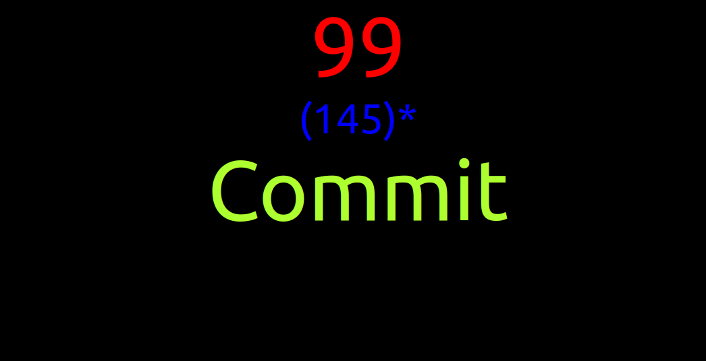

# Investigates concurrent editing notification, lightweight implementation

Lightweight solution for the concurrent editing problem described at large in the _concurrent editing notification_ [sibling project](../concurrent-editing-notification/)

Although highly efficient, current approach is impractical for complex applications as lacks good encapsulation. 

The solution leverages undocumented and possibly evolving _PropertyDDS_:
- internal API. 
- serialization format.
- internal state transitions

For the same reason the solution lacks portability.

# Getting Started

Needed dependencies
```
$ node --version
v16.13.1

$ npm --version
8.1.2
```

Using NVM for node version management
```sh
nvm use v16.13.1
```
## Build

```sh
cd FluidPatterns
npm run clean
npm install --legacy-peer-deps
npm run build
```


## Run

Terminal 1

```sh
npx tinylicious
```

Terminal 2

```sh
cd FluidPatterns/apps/concurrent-editing-notification-light
npm start
```

## Description

Super simplified notification demonstration using a single workspace and the internal api, state transitions and serialization format of _PropertyDDS_. Because of the above identified shortcomings this exercise serves only to formulate the theoretical foundation for its own rejection and is not a complete _blue/red dot_ instantiation.

## Sequence Diagram


Edit the above [diagram](https://sequencediagram.org/index.html#initialData=C4S2BsFMAIGEHsB2BjArgJ3ZRxoFEATMERAc2gDl5QAzEZAQ1CWgBkRSALYAKB4AcG6UMhCCc0AILh6kAUJFiGEgOrx0AawDOg5JAC002fOH0lEgMqchkAgAV08fpGEBPACpYDRvXz4+DAD4AKjVNHQY9Qxk9AC4SMD4w7V1vGKDgqxt7R2c3T0g02XjERJ5kiKiA-UCsrBynF2APL2jirFIQLWAXWAZwcAAjSI0eUkdUfmgAYgAmGlnIAHZB6AAREBoaKXSZgHdOMDlqwIDY4a1IGUQ5CtS2qNP02PB4RnALYCY5cvUUyKKegAPPo6rYHI18q0zohqJtXKw3v0ALLwIh0RjMRB+O4Ah5BGFwmiuWDWMiQCyQYCo9EgWw8AIg2rWeoQvLNAqAyCxYBeAB0jmobKarj5zkQRDIpOUpEgWj4-Vw4slpGl5PljJqYIa7JahXxsUgAA9eZFgAAlSAAW2okDW8CtDBIADV+qhIAAKXmFAXW23uMSxSnoED9EAAL1satllOAAEoGekamcsDaep9vjwrpdoInZMnnlhLha-emvj0sxLKwRc3wgA).

## Preview



## Disclaimer

This project has adopted the [Microsoft Open Source Code of Conduct](https://opensource.microsoft.com/codeofconduct/).
For more information see the [Code of Conduct FAQ](https://opensource.microsoft.com/codeofconduct/faq/) or contact
[opencode@microsoft.com](mailto:opencode@microsoft.com) with any additional questions or comments.

This project may contain Microsoft trademarks or logos for Microsoft projects, products, or services. Use of these
trademarks or logos must follow Microsoft’s [Trademark & Brand Guidelines](https://www.microsoft.com/trademarks). Use of
Microsoft trademarks or logos in modified versions of this project must not cause confusion or imply Microsoft
sponsorship.
