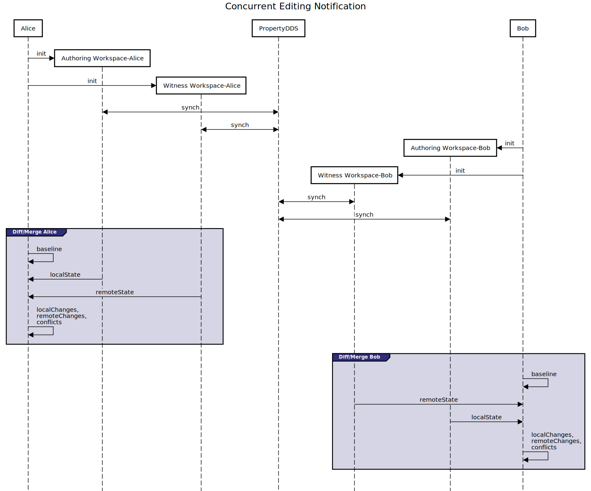
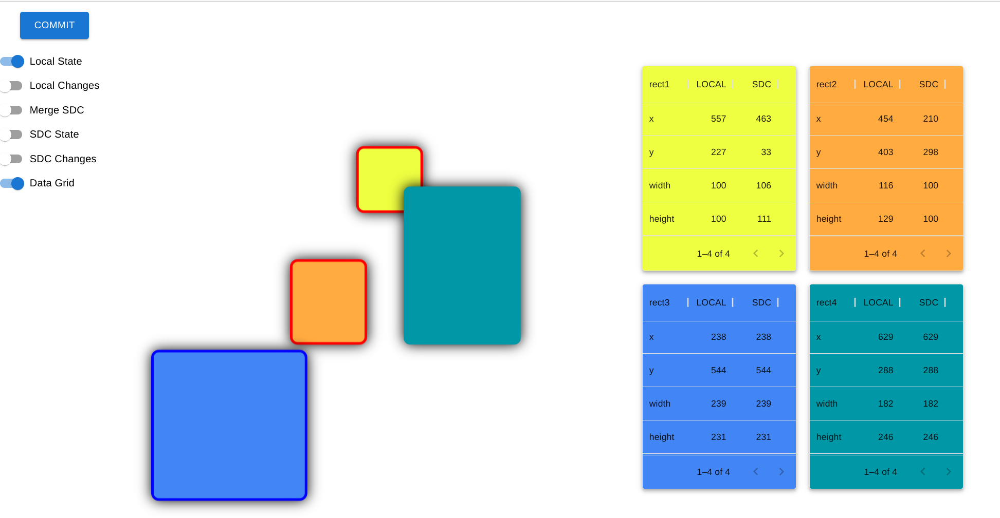
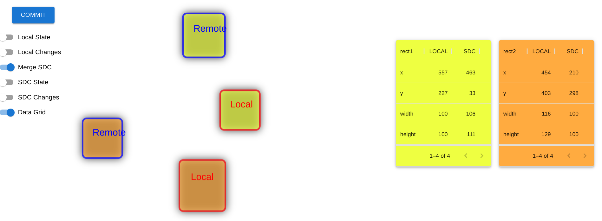

# Investigates concurrent editing notification

# Getting Started

Needed dependencies
```
$ node --version
v16.13.1

$ npm --version
8.1.2
```

Using NVM for node version management
```sh
nvm use v16.13.1
```
## Build

```sh
cd FluidPatterns
npm run clean
npm install --legacy-peer-deps
npm run build
```


## Run

Terminal 1

```sh
npx tinylicious
```

Terminal 2

```sh
cd FluidPatterns/apps/concurrent-editing-notification
npm install -g serve
serve -s build # for perf concerns avoid starting in dev mode (npm start)
```

## Description
When an application has uncommitted changes, it is desirable to perform a consistency check before committing. This avoids other changes being overwritten when several changes have been made at different times.

In source code, reconciling these changes is usually a manual process. It can be assisted with a change detection mechanism to compare the deltas and see if there are any overlapping changed files or sections of a file. If there are none, the merge can be performed automatically.

When an application has a long editing session, others will be making changes to some or all of the same data in real-time. Should another change be made that affects a non-overlapping subtree than the current user, the purpose for the change should be made visible to the user to help inform of a potential breaking change.


> Note 1: The scenario described above is implicitly assuming a real-time collaboration with longer Smart Data Contract editing sessions. Needs to be said that similar to any long database transactions, this is fundamentally an anti-pattern.

> Note 2: There are other situations, such with reconciling offline work. This is manifested with collaborators working in development branches and would need to reconcile local changes vs. remote changes. Identifying conflicts and having powerful merge mechanisms is essential. This scenario is also interesting as would essentially follow other known best-practices from SCM world, such continuous integration (integrate early, integrate often). Deserves mentioned that Smart Data Contract infrastructure is not supporting branching and offline work at this stage.

There are 2 (two) levels of notification which in general needs accounted for:

- __Blue dot__ - describing parallel changes which are informal to the SDC authoring session, updates which did not directly impact current authoring session (non-conflictual). For instance an arbitrary baseline can be used for detecting the change (eg previous commit, or even user arbitrary choice). The experience draws from paradigms already proposed by shared document editing features (eg. Google/MSFT Slides) which present a given user with the option to review changes which happened while inactive.

- __Red dot__ - describing parallel changes which are possibly impacting the data consistency of SDC authoring session. These are conflicts, which in case resolved via automated LWW could be interpreted as data loss. This scenario is not having a counterpart in the document editing experience but evaluated to be super significant in the engineering use-cases. The authoring user needs informed and given the ability to re-evaluate own change (which otherwise would have overwriting effects on the remote change).

## Scenario

A scenario based on graphical artifacts is chosen. An assembly / mechanism consisting of 4 components with variable dimensions & positioning is edited in parallel by multiple participants. As changes are not immediately committed, visual feedback ensures that collaborators recognize in-real time changes made by others and are alerted on conflicts. A visual merging tool assists with conflict resolution. 

## Strategy

Current proposal tries to address the concerns formulated with the [lightweight solution](../concurrent-editing-notification-light/). The goal is to demonstrate a portable pattern (ie relative to PropertyDDS to TreeDDS evolution). The intention is to abstract dependencies so that patterns can remain reusable and conceptually agnostic to the underlying data and ui technologies. 


## Sequence 



## Local Workspace



## Local / Remote Workspaces


## Merge



