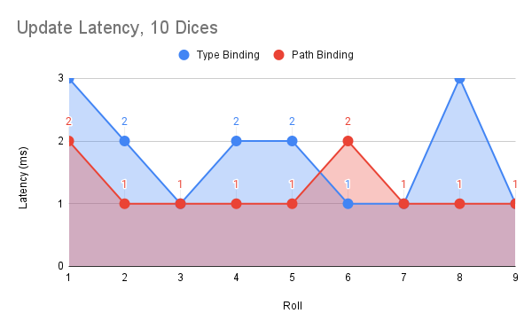
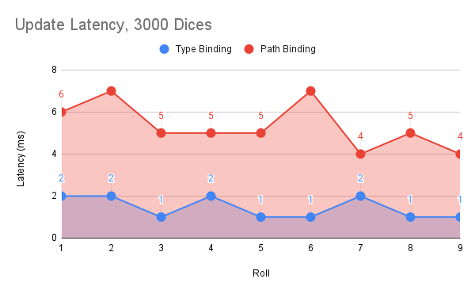

# Comparative Performance Binding Evaluation 

Based on the conclusions from [Array Slice Property Data Binder](../array-slice-property-binder) and [Array Slice Property Data Binding](../array-slice-property-binding) investigation we believe is important to validate the scalability characteristics of the two categories of solutions. However this is NOT a exhaustive benchmark, but just an attempt to sketch the performance and scalability trend lines. The absolute value of the presented results is more or less irrelevant (as has to do a lot with the test heuristics). More meaningful to interpret is the ratio between the result values obtained in similar test conditions for `Path Binding` and `Type Binding`


# Vocabulary

- __Path Binding__ - refers to the ability to listen for _insert, modify, remove, etc._ Property DDS data changes __by registering absolute navigation paths__ via the [DataBinder](https://github.com/microsoft/FluidFramework/blob/main/experimental/PropertyDDS/packages/property-binder/src/data_binder/dataBinder.ts) interface.
- __Type Binding__ - refers to the ability to listen for _insert, modify, remove, etc._ Property DDS data changes __by registering type specific [Data Binding](https://github.com/microsoft/FluidFramework/blob/main/experimental/PropertyDDS/packages/property-binder/src/data_binder/dataBinding.ts) artifacts__


# TL;DR

The data binding infrastructure is an impressive piece of software with outstanding performance characteristics in its both incarnations: `Type Binding` and `Path Binding`. Scalability is bound to the available memory. `Type Binding` is not impacted at all by the size of the _Property Tree_. `Path Binding` displays a slight deprecation as the _Property Tree_ gets bigger. Please read further for more details.


# Theoretical considerations

1.  The `Type Binding` strategy is likely to have better efficiency. As the [Change Set](https://github.com/microsoft/FluidFramework/blob/main/experimental/PropertyDDS/packages/property-changeset/src/changeset.ts) operation structures (_insert, modify, remove, etc._) carry the `typeid` attribution, à la:
```json
{
 "modify": {
  "hex:dice-1.0.0": {
   "dice": {
    "Int32": {
     "diceValue": {
      "value": 135,
     }
    }
   }
  }
 }
}
```
dispatching them to the callbacks is a relatively inexpensive operation even with instances of the `dice` (ie. `hex:dice-1.0.0`) stored at many locations (1000s ?) in the property tree.

2. The `Type Binding` strategy is conceptually more modular and helps creating maintainable applications. The association between data templates (ie. typed structs, eg.  `hex:dice-1.0.0`) and stable binding rules (ie. immutable at runtime) represent in our view a design choice super relevant in promoting consistency for data usage. For instance multiple bindings can be defined for a given data template and data consumers have the ability to choose among this stable set. This is for instance analogous to view specifications enabling generic applications to use consistent view definitions (eg. same collection of attributes) when consuming/displaying objects of a particular type for properly categorized use cases. This pattern is used successfully in other frameworks, for instance [SimManager](https://www.mscsoftware.com/product/simmanager) portal platform.

3. The `Path Binding` strategy shines for dynamic use-cases. For instance extracting a user specified slice of data in [Array Slice Property Data Binder](../array-slice-property-binder) exercise. While such cases are possible and should not be discouraged, the designer should always evaluate whether a `Type Binding` is not possible for the use-cases at hand. The exercise in the [Array Slice Property Data Binder](../array-slice-property-binder) could actually be solved with a set of static binding definitions. The example is simplistic, but useful to convey the idea: the goal to display only the first page of a given array of data can be also covered with discrete binding specs (eg. [0..10], [10..20], [20..30]) instead of a single & variable binding specification (eg. `defineBinding(startIndex, endIndex)`). In production code such pattern may represent an indicator of a less formal data or use-case model.

4. The `Type Binding` and   `Path Binding` strategies are complementary and can be combined in a single application.

# Components

The exercise shows that both `Type & Path Binding` are close relatives in terms of application architecture. The vast majority of components and artifacts are reusable. The bits for each specific strategy can be encapsulated in a single dedicated component, ie the _Domain Adapter_ for the _Path Binding_ and the _Domain Binding_ for the _Type Binding_ strategies.

__Type Binding Layers & Data Flow__


__Path Binding Layers & Data Flow__


# Validation

We compare the performance of the 2 categories of binding. The strategy is to measure the latency of local operations from publishing to the event dispatching associated with the binding. The change latency (`latency = (bindingTime - publishingTime)`) is a good indicator however the heuristics will have to acknowledge the multiple operations associated with a given logical change. The tests show very similar performance characteristics, as anticipated with a slight edge for the `Type Binding` strategy in case of large and very large property sets.








## Disclaimer

This project has adopted the [Microsoft Open Source Code of Conduct](https://opensource.microsoft.com/codeofconduct/).
For more information see the [Code of Conduct FAQ](https://opensource.microsoft.com/codeofconduct/faq/) or contact
[opencode@microsoft.com](mailto:opencode@microsoft.com) with any additional questions or comments.

This project may contain Microsoft trademarks or logos for Microsoft projects, products, or services. Use of these
trademarks or logos must follow Microsoft’s [Trademark & Brand Guidelines](https://www.microsoft.com/trademarks). Use of
Microsoft trademarks or logos in modified versions of this project must not cause confusion or imply Microsoft
sponsorship.
