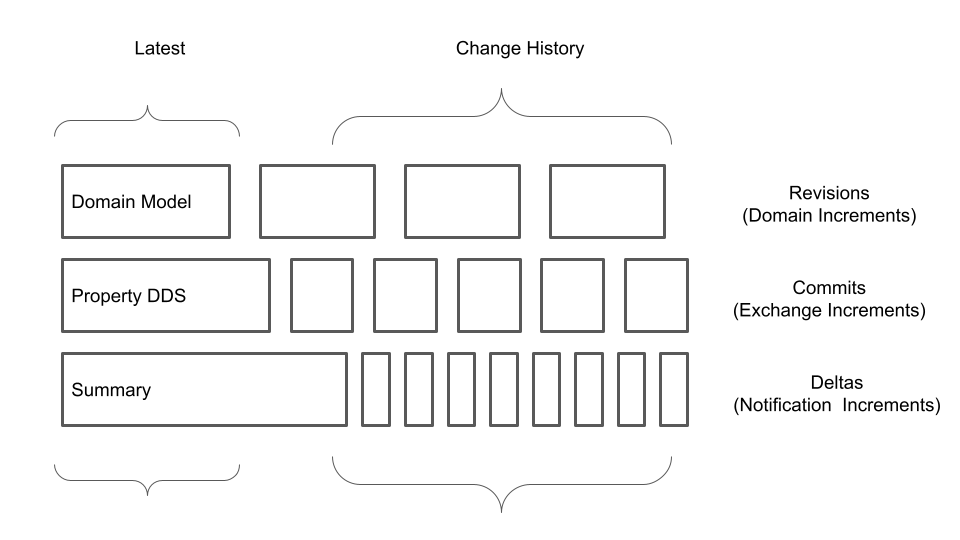
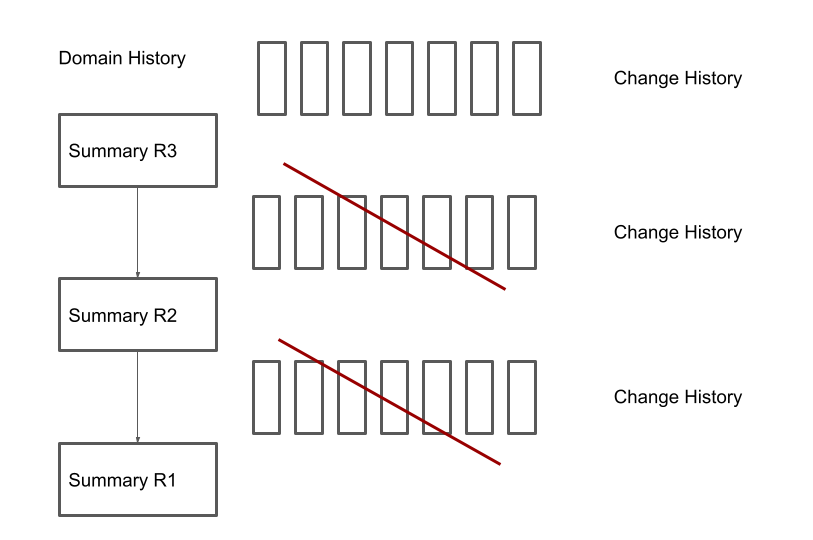
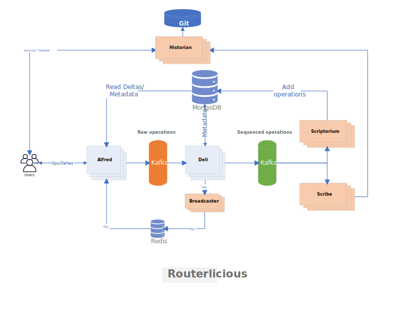
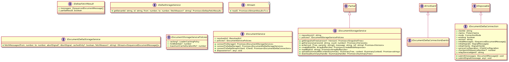
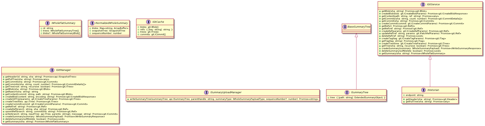
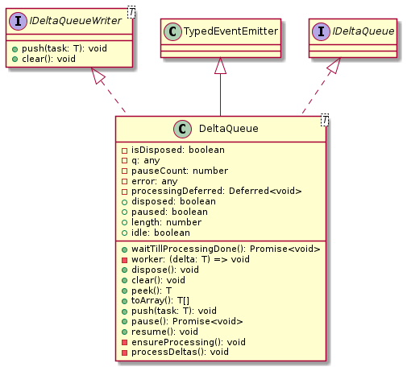
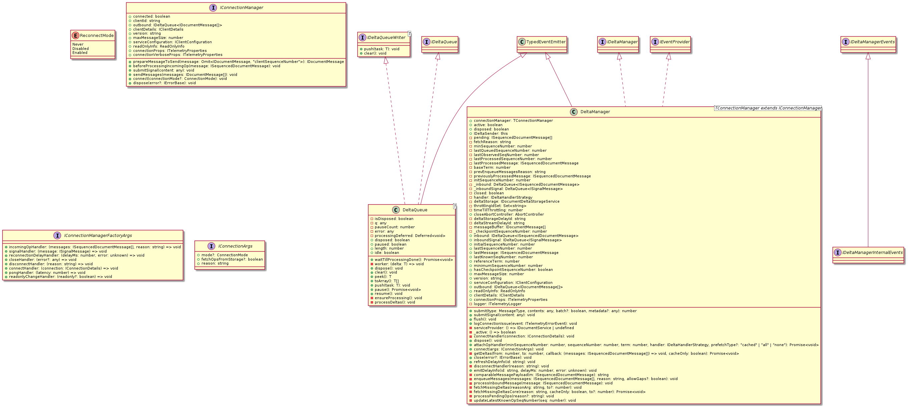
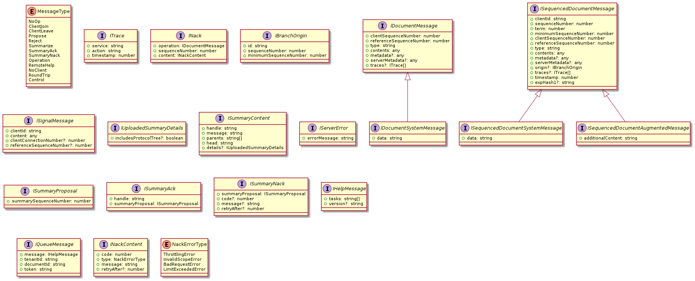
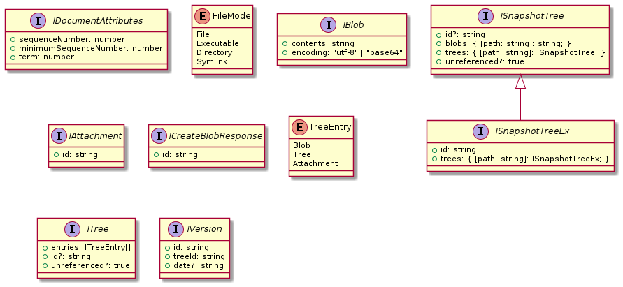
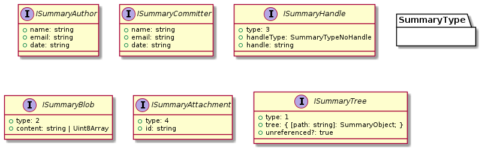

# Notes on Data Services and Data Consistency in FluidFramework

# Motivation

The goal of the current document and the related investigation effort is to improve our understanding of [FluidFramework](https://github.com/microsoft/FluidFramework) design with respect to data management. The main interest points revolve around:

1. __Consistency:__ Understanding the risks and analyze the technical solution to eventual data consistency challenge. 
2. __Fitness:__ Unveiling the data flows and persistence architecture so that we can better assess their fitness to engineering use-cases.
3. __Scalability:__ Design / technology imposed limits to the performance and scalability characteristics

and are meant to chart the contribution needs to the the open-source space from the engineering standpoint.  

# Storage Services

The central interface responsible for container data exchange is the [IDocumentService](https://github.com/microsoft/FluidFramework/blob/05620a70827bedf6038ddb3a51697d58e92fd854/common/lib/driver-definitions/src/storage.ts#L261). The document service is providing access to critical downstream services such:
- __Storage services__ (`IDocumentStorageService`) - responsible to deliver data snapshots on request, 
- __Delta stream__ (`IDocumentDeltaConnection`) - required to streamline incremental document changes in form of pub/sub interactions
- __Delta storage services__ (`IDocumentDeltaStorageService`) - which provides on-demand access to the stored deltas for a given shared object, essentially required to patch the communication gaps, such undelivered messages


```ts
export interface IDocumentService {
    /**
     * Access to storage associated with the document...
     */
    connectToStorage(): Promise<IDocumentStorageService>;

    /**
     * Access to delta storage associated with the document
     */
    connectToDeltaStorage(): Promise<IDocumentDeltaStorageService>;

    /**
     * Subscribes to the document delta stream
     */
    connectToDeltaStream(client: IClient): Promise<IDocumentDeltaConnection>;
	//..
}
```

The transport layer is a combination of `HTTP/REST` and `TCP/WS`, as follows:

- __Storage services__ - Exclusively `HTTP/REST`
- __Delta stream__ - `TCP/WS` or `HTTP long-polling` (fallback)
- __Delta storage services__ - Exclusively `HTTP/REST`

> __Fitness note:__ _The data transport choices are reflecting more or less the status quo for good portability in web environment today. Deserves mentioned that additional protocols are currently emerging. See more details below. Related to this concern, although not plug-and-play yet, the software has the ability to allow additional transport (e.g. `IDocumentDeltaConnection` interface) implementations. In this respect, we find very attractive the configuration patterns used by other open-source libraries such [libp2p](https://github.com/libp2p/js-libp2p/blob/master/doc/CONFIGURATION.md#transport)._

> __Fitness note details:__ _HTTP is a particularly slow protocol to transfer larger amounts of data (which could be the case of BLOBs especially when related to data management scenario). WebSocket has indeed large browser base support and the state of art today for _low latency_ connections, however still `TCP` based whereas actually lacking delivery guarantee support. I believe we would like to research more efficient alternatives to the `HTTP/REST` and `TCP/WS` communication. In standard transport space [WebTransport](https://web.dev/webtransport/), [WebRTC](https://developer.mozilla.org/en-US/docs/Web/API/RTCDataChannel), [Quick](https://www.chromium.org/quic/) seem to have the edge today. Also a purpose built alternative to guarantee delivery seems attractive (as a more streamlined solution to the in-flight delta corrections)._ 

# Initial Loading

To date the loading process represents a series of `REST` calls to fetch the snapshot tree. In the case of [FluidHelloWorld](https://github.com/microsoft/FluidHelloWorld) the loading yields a varying number of `REST` calls. 

```
POST http://localhost:7070/repos/tinylicious/commits?token=dGlueWxpY2lvdXM=&count=1&sha=674cdb0a-32b5-47e9-bdff-6771e474cb5c
POST http://localhost:7070/repos/tinylicious/git/trees/61f215cc922025a0bfcbd4f3f3f20d18f249b622?token=dGlueWxpY2lvdXM%3D&recursive=1
POST http://localhost:7070/repos/tinylicious/git/blobs/281a05982b6d4d03bc3df509ecdbc22a196cc69a?token=dGlueWxpY2lvdXM%3D
// ... many more, in FluidHelloWorld initial loading we counted 32 REST calls
```

The call stacks (reduced for brevity) invoke alternatively `getCommits`, `getTree`, `getBlob` on the [historian client driver](https://github.com/microsoft/FluidFramework/blob/e590fc4e333dde694913a2902abd3811e5ca3e5b/server/routerlicious/packages/services-client/src/historian.ts#L33).

__Commits__
```
getCommits (@fluidframework/server-services-client/lib/historian.js#58)
getCommits (@fluidframework/server-services-client/lib/gitManager.js#68)
getVersions (@fluidframework/routerlicious-driver/lib/shreddedSummaryDocumentStorageService.js#42)
getVersions (@fluidframework/routerlicious-driver/lib/shreddedSummaryDocumentStorageService.js#38)
getVersions (@fluidframework/container-loader/lib/retriableDocumentStorageService.js#31)
getVersion (@fluidframework/container-loader/lib/container.js#782)
fetchSnapshotTree (@fluidframework/container-loader/lib/container.js#1286)
load (@fluidframework/container-loader/lib/container.js#828)
resolve (@fluidframework/container-loader/lib/loader.js#124)
```
__Trees__
```
getTree (@fluidframework/server-services-client/lib/historian.js#95)
getTree (@fluidframework/server-services-client/lib/gitManager.js#78)
rawTree (@fluidframework/routerlicious-driver/lib/shreddedSummaryDocumentStorageService.js#67)
getSnapshotTree (@fluidframework/routerlicious-driver/lib/shreddedSummaryDocumentStorageService.js#63)
getSnapshotTree (@fluidframework/container-loader/lib/retriableDocumentStorageService.js#25)
fetchSnapshotTree (@fluidframework/container-loader/lib/container.js#1292)
load (@fluidframework/container-loader/lib/container.js#267)
resolve (@fluidframework/container-loader/lib/loader.js#124)
```

__Blobs__
```
getBlob (@fluidframework/server-services-client/lib/historian.js#49)
getBlob (@fluidframework/server-services-client/lib/gitManager.js#85)
readBlob (@fluidframework/routerlicious-driver/lib/shreddedSummaryDocumentStorageService.js#87)
prefetchTreeCore (@fluidframework/driver-utils/lib/prefetchDocumentStorageService.js#73)
prefetchTree (@fluidframework/driver-utils/lib/prefetchDocumentStorageService.js#61)
getSnapshotTree (@fluidframework/driver-utils/lib/prefetchDocumentStorageService.js#30)
fetchSnapshotTree (@fluidframework/container-loader/lib/container.js#1292)
load (@fluidframework/container-loader/lib/container.js#828)
resolve (@fluidframework/container-loader/lib/loader.js#124)
```

The _snapshot tree_ carries many details of the instantiated container, as revealed by the following sniffed payload:

```json
{
	"sha": "110f6c7a21ea2c4ee4aa7ebecfccec7570279179",
	"tree": [
		{
			"path": ".channels",
			"mode": "40000",
			"sha": "d70feaff1cdeebb6a9f840042e25260549f7b1f6",
			"size": 0,
			"type": "tree",
			"url": ""
		},
		{
			"path": ".channels/rootDOId",
			"mode": "40000",
			"sha": "81603a45314ce7a15350b5815e33f0c02b508fbb",
			"size": 0,
			"type": "tree",
			"url": ""
		},

		/* ... 20 more entries */
	],
	"url": ""
}
```

The blobs deliver specific information fragments, for instance one of them is the actual dice value:

`POST http://localhost:7070/repos/tinylicious/git/blobs/2596468d73c95dee0c383702be864355415514d5?token=dGlueWxpY2lvdXM%3D`

```json
{
    "url": "",
    "sha": "c35bbe00f9cb9ee99c8af3d4757411abdda3d8f3",
    "size": 70,
    "content": "eyJwa2ciOiJbXCJyb290RE9cIl0iLCJzdW1tYXJ5Rm9ybWF0VmVyc2lvbiI6MiwiaXNSb290RGF0YVN0b3JlIjp0cnVlfQ==",
    "encoding": "base64"
}
```
which decoded is:

```json
{
    "blobs": [],
    "content": {
        "dice-value-key": {
            "type": "Plain",
            "value": 1
        }
    }
}
```

but many other carry useful metadata, eg.:

`POST http://localhost:7070/repos/tinylicious/git/blobs/9f1825d093f8c88322cb1ffc582cc7ea259c589d?token=dGlueWxpY2lvdXM=`

```json
{
    "url": "",
    "sha": "9f1825d093f8c88322cb1ffc582cc7ea259c589d",
    "size": 55,
    "content": "eyJtaW5pbXVtU2VxdWVuY2VOdW1iZXIiOjAsInNlcXVlbmNlTnVtYmVyIjowLCJ0ZXJtIjoxfQ==",
    "encoding": "base64"
}
```
which decoded reveals to the actual `minimumSequenceNumber` and `sequenceNumber` of the current snapshot, however de-contextualized:

```json
{
    "minimumSequenceNumber": 0,
    "sequenceNumber": 0,
    "term": 1
}
```

The architectural intention seems to be creating a virtual (and versioned) file system storing in a predictable topology all relevant information associated with a given container and the encapsulated distributed data structures (DDS).

Technically the snapshots trees are stored by a Git service. Furthermore the API offered by the [IDocumentStorageService](https://Github.com/microsoft/FluidFramework/blob/05620a70827bedf6038ddb3a51697d58e92fd854/common/lib/driver-definitions/src/storage.ts#L111) is organically tied to the Git conceptual domain (that is adopts concepts such commits, trees and blobs building-up faithfully on the [Git terminology](https://git-scm.com/book/en/v2/Git-Internals-Git-Objects)).

The usage of the interface is `read-only`.

As shown above in the client-side call stacks, [the gitManager](https://github.com/microsoft/FluidFramework/blob/9e31a7895e6a7531da1ecebc13a8216b9ffe74ab/server/routerlicious/packages/services-client/src/gitManager.ts#L14) respectively [the historian](https://github.com/microsoft/FluidFramework/blob/9e31a7895e6a7531da1ecebc13a8216b9ffe74ab/server/routerlicious/packages/services-client/src/historian.ts#L33) are serving as proxies to the actual data storage backend.

```ts
/**
 * Interface to provide access to snapshots saved for a shared object
 */
export interface IDocumentStorageService extends Partial<IDisposable> {
    repositoryUrl: string;

    /**
     * Policies implemented/instructed by driver.
     */
    readonly policies?: IDocumentStorageServicePolicies;

    /**
     * Returns the snapshot tree.
     */
    getSnapshotTree(version?: IVersion): Promise<ISnapshotTree | null>;

    /**
     * Retrieves all versions of the document starting at the specified versionId - or null if from the head
     */
    getVersions(versionId: string | null, count: number): Promise<IVersion[]>;

    /**
     * Writes to the object with the given ID
     */
    write(root: ITree, parents: string[], message: string, ref: string): Promise<IVersion>;

    /**
     * Creates a blob out of the given buffer
     */
    createBlob(file: ArrayBufferLike): Promise<ICreateBlobResponse>;

    /**
     * Reads the object with the given ID, returns content in arrayBufferLike
     */
    readBlob(id: string): Promise<ArrayBufferLike>;

    /**
     * Uploads a summary tree to storage using the given context for reference of previous summary handle.
     * The ISummaryHandles in the uploaded tree should have paths to indicate which summary object they are
     * referencing from the previously acked summary.
     * Returns the uploaded summary handle.
     */
    uploadSummaryWithContext(summary: ISummaryTree, context: ISummaryContext): Promise<string>;

    /**
     * Retrieves the commit that matches the packfile handle. If the packfile has already been committed and the
     * server has deleted it this call may result in a broken promise.
     */
    downloadSummary(handle: ISummaryHandle): Promise<ISummaryTree>;
}

/**
 * A tree entry wraps a path with a type of node
 */
export type ITreeEntry = {
    // Path to the object
    path: string;
    // The file mode; one of 100644 for file (blob), 100755 for executable (blob), 040000 for subdirectory (tree),
    // 160000 for submodule (commit), or 120000 for a blob that specifies the path of a symlink
    mode: FileMode;
} & (
{
    type: TreeEntry.Blob;
    value: IBlob;
} | {
    type: TreeEntry.Commit;
    value: string;
} | {
    type: TreeEntry.Tree;
    value: ITree;
} | {
    type: TreeEntry.Attachment;
    value: IAttachment;
});


export interface ITree {
    entries: ITreeEntry[];
    // Unique ID representing all entries in the tree. Can be used to optimize snapshotting in the case
    // it is known that the ITree has already been created and stored
    id?: string;
    // Indicates that this tree is unreferenced. If this is not present, the tree is considered referenced.
    unreferenced?: true;
}
```

> __Scalability note:__ _The interaction with the Document Storage Service seems to work well but still quite verbose and fragmented. In high latency environments (such WAN) this fact alone can substantially hurt I/O. Another important scalability criteria is that the number of requests serving a particular query-case (eg. loading the container) should remain constant and desirably independent from the data and metadata content. Partly because of the Git style this seems not to be the case. We would need to better understand and evaluate alternatives to the Git file system abstraction as interaction model for data and metadata with the goal of minimizing and maintaining predictable I/O._

> __Fitness note:__ _Evolving the Git interaction style may be challenging as morphed already in the current interfaces_

# Summarizing

A summary represents in Fluid a consolidation of all operations associated with (or a snapshot of) a given distributed data structure (DDS) at a precise sequence number. They are captured by the infrastructure, however on the client-side. 

Summarizing is closely related to [initial loading](#initial-loading) as represents the functionality responsible to create and maintain the snapshot which makes possible the initial loading in first place.

> __Fitness note:__ Should agents follow the integration pattern of regular collaboration clients? One important finding of our prior work is that [loading full data snapshots is not appropriate](../apps/assembly-authoring-tracked/) when externalizing data to materialized view agents. The integration explicit need is to remain delta centric. Is it possible to employ a more specialized delta transport to leverage the enterprise LAN environment benefits in selected cases. Polyglot persistence (programming language incl.) and delivery reliability may profit from introducing additional [communication protocols](https://kafka.apache.org/protocol.html#protocol_philosophy) and delta persistence strategies.

There are two execution flavors of the summarizing functionality: [heuristic-based](https://github.com/microsoft/FluidFramework/blob/89f8a77ca9b6c25c4c1f3067565f72eb616db671/packages/runtime/container-runtime/src/summarizerHeuristics.ts#L52) and [on-demand](https://github.com/microsoft/FluidFramework/blob/89f8a77ca9b6c25c4c1f3067565f72eb616db671/packages/runtime/container-runtime/src/summarizer.ts#L319).

Similar to [initial loading](#initial-loading), the functionality leverages the [the gitManager](https://github.com/microsoft/FluidFramework/blob/9e31a7895e6a7531da1ecebc13a8216b9ffe74ab/server/routerlicious/packages/services-client/src/gitManager.ts#L14) and [the historian](https://github.com/microsoft/FluidFramework/blob/9e31a7895e6a7531da1ecebc13a8216b9ffe74ab/server/routerlicious/packages/services-client/src/historian.ts#L33) capabilities.

Summarizing implementation is distributed data structure (DDS) specific. 

```ts
/**
 * Gets a form of the object that can be serialized.
 * @returns A tree representing the snapshot of the shared object.
 */
protected abstract summarizeCore(serializer: IFluidSerializer): ISummaryTreeWithStats;

// where:

export interface ISummaryTreeWithStats {
    stats: ISummaryStats;
    summary: ISummaryTree;
}

export interface ISummaryStats {
    treeNodeCount: number;
    blobNodeCount: number;
    handleNodeCount: number;
    totalBlobSize: number;
    unreferencedBlobSize: number;
}
```

Deserves probably highlighted that the summarization result (`ISummaryTree`) is itself Git-ish:

```ts

export interface ISummaryTree {
    type: SummaryType.Tree;

    tree: { [path: string]: SummaryObject };
}

export type SummaryObject = ISummaryTree | ISummaryBlob | ISummaryHandle | ISummaryAttachment;

export interface ISummaryBlob {
    type: SummaryType.Blob;
    content: string | Uint8Array;
}

export interface ISummaryAttachment {
    type: SummaryType.Attachment;
    id: string;
}
```

See also the heuristic summarizer [configuration documentation](https://github.com/microsoft/FluidFramework/blob/c71cb13c0c64d779447edffdb834a05739a0bacb/docs/content/docs/concepts/summarizer.md#summarizer)

> __Summary and History note:__ 
> 
> 
> 
> Summaries are today employed as communication baselines and have domain relevance in conjunction with the upstream changes to describe the current / latest collaboration state. Latest state is however insufficient for data (model) management. The applications typically need the entire or at least recent history of the domain model increments. Domain model revisions are semantically rich transitions from one consistent state to another. One possible evolution is to synchronize the summaries with the domain model revisions, preserve and link them as materialized history. This shift would allow a better impedance match between the logical and the physical persistence model to directly improve the I/O efficiency. Furthermore enlists low level framework support for domain meaningful history navigation (i.e. time machine). High level this optimization is trading CPU cycles in favor of disk space which typically adds cost benefits. Compression remains possible as an implementation detail, e.g. btree+ instead of linked list.
> 
> 

# Incremental Summary

The infrastructure has the ability to upload the _Summary_ incrementally. This component responsible to decide what summary partitions need uploaded is the [SummaryTreeUploadManager](https://github.com/microsoft/FluidFramework/blob/c78794f0462043bf77b8b270c4e17c8561be858e/server/routerlicious/packages/services-client/src/summaryTreeUploadManager.ts#L21) initialized at [container load request](https://github.com/microsoft/FluidFramework/blob/c78794f0462043bf77b8b270c4e17c8561be858e/packages/loader/container-loader/src/container.ts#L1124) at [start summarization procedure](https://github.com/microsoft/FluidFramework/blob/98b54f954c4cfc0faf313b6dd88869a553a02650/packages/runtime/container-runtime/src/summaryManager.ts#L190) .

The initializing call stack, reduced for brevity:

```
constructor (@fluidframework/server-services-client/lib/summaryTreeUploadManager.js#13)
constructor (@fluidframework/routerlicious-driver/lib/shreddedSummaryDocumentStorageService.js#27)
loadInternalDocumentStorageService (@fluidframework/routerlicious-driver/lib/documentStorageService.js#22)
constructor (@fluidframework/routerlicious-driver/lib/documentStorageService.js#11)
connectToStorage (@fluidframework/routerlicious-driver/lib/documentService.js#56)
connectStorageService (@fluidframework/container-loader/lib/container.js#948)
load (@fluidframework/container-loader/lib/container.js#825)
startSummarization (@fluidframework/container-runtime/lib/summaryManager.js#140)
refreshSummarizer (@fluidframework/container-runtime/lib/summaryManager.js#54)
SummarizerClientElection (@fluidframework/container-runtime/lib/summarizerClientElection.js#92)
```

The important abstraction enabling the incremental updates is a `Blob` lookup table keyed on its `hash` value. The hashing utility follows the git `hash` specification (_to return the same hash as returned by the server as blob.sha_ - as the .ts doc mentions):

```ts
/**
 * Create a github hash (Github hashes the string with blob and size)
 * Must be called under secure context for browsers
 *
 * @param file - The contents of the file in a buffer
 * @returns The sha1 hash of the content of the buffer with the `blob` prefix and size
 */
export async function gitHashFile(file: IsoBuffer): Promise<string> {
    const size = file.byteLength;
    const filePrefix = `blob ${size.toString()}${String.fromCharCode(0)}`;
    const engine = new sha1();
    return engine.update(filePrefix)
        .update(file)
        .digest("hex") as string;
}
```
The [ShreddedSummaryDocumentStorageService](https://github.com/microsoft/FluidFramework/blob/5104ee448534cbc1735e4003a0e45a86fd5be2e7/packages/drivers/routerlicious-driver/src/shreddedSummaryDocumentStorageService.ts#L92) will download and [index](https://github.com/microsoft/FluidFramework/blob/c78794f0462043bf77b8b270c4e17c8561be858e/server/routerlicious/packages/protocol-base/src/blobs.ts#L89) any additional summary increments at the summarization start so that the [SummaryTreeUploadManager](https://github.com/microsoft/FluidFramework/blob/c78794f0462043bf77b8b270c4e17c8561be858e/server/routerlicious/packages/services-client/src/summaryTreeUploadManager.ts#L93) skip at upload time.

The [RouterliciousDocumentServiceFactory](https://github.com/microsoft/FluidFramework/blob/98b54f954c4cfc0faf313b6dd88869a553a02650/packages/drivers/routerlicious-driver/src/documentServiceFactory.ts#L49) controls the lifecycle of the blobCache ([InMemoryCache](https://github.com/microsoft/FluidFramework/blob/98b54f954c4cfc0faf313b6dd88869a553a02650/packages/drivers/routerlicious-driver/src/cache.ts#L11)).


> __Fitness note:__ Replicating the [Git](https://git-scm.com/docs/hash-function-transition/) hashing algorithm on the client side is not necessarily a solution which scales easily to other document storage implementations. From that standpoint a FluidFramework controlled hashing algorithm seems more favorable.

# Incremental Updates

The [DocumentDeltaConnection](https://github.com/microsoft/FluidFramework/blob/a16019bb71b67deef3924ab47036d1aa534bafa9/packages/drivers/driver-base/src/documentDeltaConnection.ts#L38) represents a connection to a stream of delta updates. For low message delivery latency the infrastructure offers [websocket](https://developer.mozilla.org/en-US/docs/Web/API/WebSockets_API) based transport. The implementation is based on the [socket.io library](https://github.com/socketio/socket.io)

In the case of [FluidHelloWorld](https://github.com/microsoft/FluidHelloWorld), which is based on the SharedMap DDS following notification path is observed (reduced for brevity):

```
updateDice (app.js:71)
emit (events.js:153)
processCore (map.js:289)
process (sharedObject.js:294)
process (channelDeltaConnection.js:33)
processOp (remoteChannelContext.js:46)
processChannelOp (dataStoreRuntime.js:596)
processRemoteMessage (container.js:1250)
processInboundMessage (deltaManager.js:566)
push (deltaQueue.js:59)
enqueueMessages (deltaManager.js:517)
incomingOpHandler (deltaManager.js:49)
ConnectionManager.opHandler (connectionManager.js:94)
emit (events.js:153)
(anonymous) (documentDeltaConnection.js:67)
Socket.onevent (socket.js:278)
ws.onmessage (websocket.js:160)
```

Is probably worth mentioning our understanding that the `DataStore` in the Fluid container runtime (see [container runtime](#container-runtime)) terminology represents still a data snapshot, more precisely an [ISnapshotTree](https://github.com/microsoft/FluidFramework/blob/a16019bb71b67deef3924ab47036d1aa534bafa9/common/lib/protocol-definitions/src/storage.ts#L88) instantiation.

```ts
export interface ISnapshotTree {
    id?: string;
    blobs: { [path: string]: string };
    trees: { [path: string]: ISnapshotTree };
}

```

Each runtime is associated with multiple [DataStores](https://github.com/microsoft/FluidFramework/blob/05620a70827bedf6038ddb3a51697d58e92fd854/packages/runtime/container-runtime/src/dataStores.ts#L60).
 
> __Important question:__ _What are Fluid's message delivery guarantees? Is it possible that committed messages are lost when network, service or hardware failures happen?_

 Actually FluidFramework avoids the direct answer and elevates the topic in the [published documentation](https://github.com/microsoft/FluidFramework/blob/42e6f0e949b02c055de7d7f06d148bb18c66336f/docs/content/docs/concepts/tob.md#fluid-data-operations-all-the-way-down) straight to the DDS data consistency level. Citation following:


> __Fluid guarantees eventual consistency via total order broadcast.__ That is, when a DDS is changed locally by a client, that change – that is, the operation – is first sent to the Fluid service, which does three things:
>
> - Assigns a monotonically increasing sequence number to the operation; this is the “total order” part of total order broadcast.
> - Broadcasts the operation to all other connected clients; this is the “broadcast” part of total order broadcast.
> - Stores the operation’s data (see data persistence).


We will investigate in the following sections how FluidFramework accomplishes the required reliability when the underlying communication protocol offers weak delivery guarantees.

# Delta Manager

The [DeltaManager](https://github.com/microsoft/FluidFramework/blob/02a318ea8ff5ca0fae5fce8f5e3060cee6eedffd/packages/loader/container-loader/src/deltaManager.ts#L76) stays in our view at the core of the FluidFramework strategy for the __exactly-once__ message delivery guarantee.

According to the internal documentation the `DeltaManager` manages the flow of both inbound and outbound messages. This class ensures that __shared objects receive delta messages in order regardless of possible network conditions or timings causing out of order delivery__.

The essential APIs:

## Delta Queue

```ts
/**
 * Queue of ops to be sent to or processed from storage
 */
export interface IDeltaQueue<T> extends IEventProvider<IDeltaQueueEvents<T>>, IDisposable {
    /**
     * Pauses processing on the queue
     * @returns A promise which resolves when processing has been paused.
     */
    pause(): Promise<void>;

    /**
     * Resumes processing on the queue
     */
    resume(): void;

    /**
     * Peeks at the next message in the queue
     */
    peek(): T | undefined;

    /**
     * Returns all the items in the queue as an array. Does not remove them from the queue.
     */
    toArray(): T[];
}

```

## Delta Manager

```ts
/**
 * Manages the transmission of ops between the runtime and storage.
 */
export interface IDeltaManager<T, U> extends IEventProvider<IDeltaManagerEvents>, IDeltaSender, IDisposable {
    /** The queue of inbound delta messages */
    readonly inbound: IDeltaQueue<T>;

    /** The queue of outbound delta messages */
    readonly outbound: IDeltaQueue<U[]>;

    /** The queue of inbound delta signals */
    readonly inboundSignal: IDeltaQueue<ISignalMessage>;

    /** The current minimum sequence number */
    readonly minimumSequenceNumber: number;

    /** The last sequence number processed by the delta manager */
    readonly lastSequenceNumber: number;

    /** The last message processed by the delta manager */
    readonly lastMessage: ISequencedDocumentMessage | undefined;

    /** The latest sequence number the delta manager is aware of */
    readonly lastKnownSeqNumber: number;

    /** The initial sequence number set when attaching the op handler */
    readonly initialSequenceNumber: number;

	// ...
}
```

The essential tracking in the [DeltaManager](https://github.com/microsoft/FluidFramework/blob/02a318ea8ff5ca0fae5fce8f5e3060cee6eedffd/packages/loader/container-loader/src/deltaManager.ts#L76) instantiation of the `IDeltaManager` interface :

- `initSequenceNumber` - The sequence number `DeltaManager` initially loaded from. Exposed by `IDeltaManager` interface as `initialSequenceNumber`.

- `minSequenceNumber` - The minimum sequence number is a sequence seen by all clients, and all clients will specify their reference sequence number as above the minium sequence number. This mean that no new operations can come in that reference anything at or below the minimum sequence number. Exposed by `IDeltaManager` interface as `minimumSequenceNumber`.

- `lastQueuedSequenceNumber` - is the last queued sequence number. If there are gaps in seq numbers, then this number is not updated until we cover that gap, so it increases each time by 1.

- `lastObservedSeqNumber` - is  an estimation of last known sequence number for the container in storage. It's initially populated at web socket connection time (if storage provides that info) and is updated once operations show up. It's never less than lastQueuedSequenceNumber.Exposed by `IDeltaManager` interface as `lastKnownSeqNumber`.

- `lastProcessedSequenceNumber` - shares the semantics of  `lastQueuedSequenceNumber` only that is after processing. Exposed by `IDeltaManager` interface as `lastSequenceNumber`.


Based on the sequence number tracking, the `DeltaManager` has the ability to __apply corrections in form of retrieving the missing deltas between the given sequence numbers__. The `from` is typically implied as `lastQueuedSequenceNumber + 1` whereas `to` is supplied as argument to the delta recovery call:

```ts
private fetchMissingDeltas(reason: string, to?: number){
	//..
}
```

The delta queue correction requests are resolved internally by the __Delta Storage Service__. 

> __Fitness note:__ _Review and monitor data consistency related github issues [eg. is:issue is:open DeltaManager](https://github.com/microsoft/FluidFramework/issues?q=is%3Aissue+is%3Aopen+DeltaManager)_


# Delta Storage Service

For the contingent behavior, the interface responsible to provide access to the deltas associated with a given `SharedObject` is  [IDeltaStorageService](https://github.com/microsoft/FluidFramework/blob/e85239320a86c29d20c5d322273aee6b4e00af8b/common/lib/driver-definitions/src/storage.ts#L44).

```ts
export interface IDeltaStorageService {
    /**
     * Retrieves all the delta operations within the inclusive sequence number range
     * @param tenantId - Id of the tenant.
     * @param id - document id.
     * @param from - first op to retrieve (inclusive)
     * @param to - first op not to retrieve (exclusive end)
     * @param fetchReason - Reason for fetching the messages. Example, gap between seq number
     *  of Op on wire and known seq number. It should not contain any PII. It can be logged by
     *  spo which could help in debugging sessions if any issue occurs.
     */
    get(
        tenantId: string,
        id: string,
        from: number, // inclusive
        to: number, // exclusive
        fetchReason?: string,
    ): Promise<IDeltasFetchResult>;
}
```

The actual [implementation](https://github.com/microsoft/FluidFramework/blob/3014a37507cf4ae82752b6099ce36eca3578e719/packages/drivers/routerlicious-driver/src/deltaStorageService.ts#L80)  performs a `HTTP/REST` call to Alfred's [getDeltas endpoint](https://github.com/microsoft/FluidFramework/blob/3014a37507cf4ae82752b6099ce36eca3578e719/server/routerlicious/packages/routerlicious-base/src/alfred/routes/api/deltas.ts#L28).

In current routerlicious instantiation, the deltas are stored and retrieved from a MongoDb database. See also [Fluid Relay Topology](#fluid-relay-topology) in the [Addendum](#addendum) section for a visual representation of the delta storage interaction.


> __Fitness note:__ _The custom Mongo delta storage exposes similar functionality with traditional [Event Stores](https://en.wikipedia.org/wiki/Event_store) (which is an established _Event Sourcing_ architectural style component designed explicitly for immutability, scalability and performance). Investigate low maintenance, high performance alternatives._


# Addendum

## Container Runtime

_(Mentioned in the addendum for better overview, out of the declared scope)_

The conceptual Fluid entry point is the [container loader](https://github.com/microsoft/FluidFramework/tree/main/packages/loader/container-loader) which makes up the minimal kernel of the Fluid runtime. 

This kernel is responsible to:
- Provide access to the Fluid storage 
- Ensure consensus over a quorum of clients. 

Storage includes snapshots as well as the live and persisted operation stream. The consensus system allows clients within the collaboration window to agree on container's properties. One example of this is the npm package that should be loaded to process operations applied to the container.


## Quorum and Proposal

_(Mentioned in the addendum for better overview, out of the declared scope)_

A shared protocol is used to establish value consensus across clients associated with a given Fluid session. The starting transport layer is `HTTP/REST` and upgraded to `TCP/WS` (HTTP 101).

A [Quorum](https://github.com/microsoft/FluidFramework/blob/c7c985443a1c25df9d68f06390a32981a8c3c508/server/routerlicious/packages/protocol-base/src/quorum.ts#L346) represents all clients currently within the collaboration window. As well as the values they have agreed upon and any pending proposals.

The QuorumProposals [class](https://github.com/microsoft/FluidFramework/blob/c7c985443a1c25df9d68f06390a32981a8c3c508/server/routerlicious/packages/protocol-base/src/quorum.ts#L137) holds a key/value store.  Proposed values become finalized in the store once all connected clients have agreed on the proposal.

A quorum proposal transitions between four possible states: propose, accept, reject, and commit.

A proposal begins in the propose state. The proposal is sent to the server and receives a sequence number which is
used to uniquely identify it. Clients within the collaboration window accept the proposal by allowing their
reference sequence number to go above the sequence number for the proposal. They reject it by submitting a reject
message prior to sending a reference sequence number above the proposal number. Once the minimum sequence number
goes above the sequence number for the proposal without any rejections it is considered accepted.

The proposal enters the commit state when the minimum sequence number goes above the sequence number at which it
became accepted. In the commit state all subsequent messages are guaranteed to have been sent with knowledge of
the proposal. Between the accept and commit state there may be messages with reference sequence numbers prior to
the proposal being accepted.


## Fluid Relay Topology




## Class Diagrams

### Client Storage



### Service Storage



### Delta Queue



### Delta Manager



### Communication Protocol Definitions



### Storage Protocol Definitions



### Summary Protocol Definitions




## Disclaimer

This project has adopted the [Microsoft Open Source Code of Conduct](https://opensource.microsoft.com/codeofconduct/).
For more information see the [Code of Conduct FAQ](https://opensource.microsoft.com/codeofconduct/faq/) or contact
[opencode@microsoft.com](mailto:opencode@microsoft.com) with any additional questions or comments.

This project may contain Microsoft trademarks or logos for Microsoft projects, products, or services. Use of these
trademarks or logos must follow Microsoft’s [Trademark & Brand Guidelines](https://www.microsoft.com/trademarks). Use of
Microsoft trademarks or logos in modified versions of this project must not cause confusion or imply Microsoft
sponsorship.